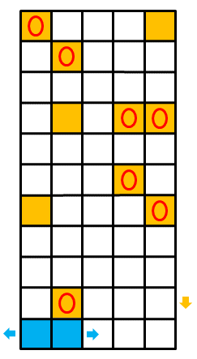

## Task

#### Computer retro game

We consider a computer game in which a player controls a basket consisting of two blue pixels placed side by side in horizontal direction. He uses this basket to catch falling single-pixel eggs. The pixels of the eggs are orange. The other pixels in the game are background pixels and have a different color from the basket and eggs. The time in the game is dicreet. In one time unit (stroke), the eggs are moved one pixel down. During the turn, the player can move the basket one pixel to the right or left, but only if none of the pixels of the basket leaves the rectangular playing area by moving. The player can also leave the position of the basket unchanged. If the egg reaches the bottom row and its position coincides with the position of one of the blue pixels in the basket, it is caught. In the subsequent turn, the eggs on the bottom line disappear from the game, whether they were caught or not. For each egg caught, the player gets one point.

  

#### Input (example)

`5 10`   width of game field & number of eggs   
`2 1`  
`1 4`  
`5 4`  
`4 5`  
`5 7`  
`4 7`  
`2 7`  
`2 9`  
`1 10`  
`5 10`   coordinates [column & height] of each egg 

#### Output (example)

`7`  maximum of score player can achieve 

## Solution

In order to obtain time complexity of the program as small as possible (which was the main goal of these tasks) it is needed to gradually fill each pixel up to the height of the last (highest seated) egg with a maximum of possible score reached in the game with the position of the basket (respectively left pixel of the basket) in this pixel. In the end, all we have to do is select maximum of these values from the pixels with the biggest height.

#### Iterations 

At the beginning it is possible to fill only the initial position of the left pixel of the basket which is according to the task assignment always leftmost column. It's filled with the number 0 because we haven't come across any eggs yet:

 1st iteration 
| col:1 | col:2 | col:3 | col:4 |    
| :---: | :---: | :---: | :---: |
|  ...  |  ...  |  ...  |  ...  |
|   0   |  N/A  |  N/A  |  N/A  |  

After we propagate 'largest possible' (according to dynamics of basket) value(s) from the previous row to the corresponding pixels, we increment those pixels which could catch an egg (if these were left pixels of basket):

 2nd iteration 
| col:1 | col:2 | col:3 | col:4 |    
| :---: | :---: | :---: | :---: |
|  ...  |  ...  |  ...  |  ...  |
|   1   |   1   |  N/A  |  N/A  |
|   0   |  N/A  |  N/A  |  N/A  | 

 3rd iteration 
| col:1 | col:2 | col:3 | col:4 |    
| :---: | :---: | :---: | :---: |
|  ...  |  ...  |  ...  |  ...  |
|   1   |   1   |    1  |  N/A  |
|   1   |   1   |  N/A  |  N/A  |
|   0   |  N/A  |  N/A  |  N/A  |  

#### Compiling and testing

`g++ main.cpp -o main`  
  
`./main < datapub/pub**.in`

